# Introduction

Threat Intelligence is a fairly superfluous component to security for most individuals or organisations that are growing the security function. This is typically due to cost, scaling it into wider systems, or seeing the true value of running their own solution, when it is baked into anti-virus or provided by a Managed Detection and Response (MDR) provider.

  

This post outlines a modern solution to creating a scalable threat intelligence pipeline that does not compromise on functionality that organisations are implementing in this day and age. Whether you are looking to conduct solo research, proof-of-concept, or a larger team that has matured to the point of requiring a threat intelligence pillar to complement the security program, everyone should have access to threat intelligence at all stages of maturity.

  

The blog post is split into three sections:

1. **System Requirements** - The section highlights the main system requirements of the implementation
2. **Architecture** - The section focuses on the architectural view of the implementation, limitations, and potential adaptations that can fit into a wider ecosystem that has access to dedicated finances.
3. **Implementation** - The section focuses on the implementation and the ideas behind each section in more detail
4. **Technical Challenges** - The section discusses on the technical constraints and workarounds that were encountered during development
5. **Bibliography** - This section provides hyperlinks to the resources used that aided in the development of this pipeline

The split between the architectural layout and the implementation, is to entice all readers from leadership and design audiences through the architecture overview, as well as, the engineers and researchers who will are looking to use this as a foundation for their own implementation.

All code and system files for the cognitive CTI project can be found at [github.com/jwhitt3r/cognitiveCTI](https://www.blogger.com/u/1/blog/post/edit/8882042398405863179/5023927187995908110?hl=en#).

# System Requirements

The motivation for this project sat with the idea of, could a self-hosted pipeline leveraging automation and artificial intelligence relate to systems built and maintained by an MDR (hey, they're the ones that actively enable this function at scale and sell it, what better role model). A number of constraints were placed on it, this is to ensure that it would enable any individual or teams to implement and adapt to meet the needs they may have. The following constraints were in place:

- Self-hosted
- Containers
- Codified
- Free (ignore electricity)
- Modular

The minimum resources used for this project, are:

- 32GB RAM
- GPU (for faster model processing)
- Docker

The system used in this project was:

- Windows 11 Pro (For Hyper-V)
- 128GB RAM
- AMD Ryzen 7950X
- Nvidia RTX 4070 Ti

The GPU was only used to improve processing, extensive testing occurred using the CPU for its AI processing. However, it is encouraged that the GPU be used for actual more timely intel pipeline.

# Architecture

The following section provides a high-level architectural overview of the pipeline, its components, and how they interact with one another. The diagram is intentionally abstracted away from the implementation detail as to provide an accessible illustration of the system as to allow wider audiences with enough context to understand the system, its purpose, and where it can be adapted to fit into a wider ecosystem. The implementation sections that follow provide the detail for engineers and researchers looking to build on this foundation.

Figure 1 illustrates the end-to-end flow from threat data collection through to output delivery of correlated and summarised threat intelligence.

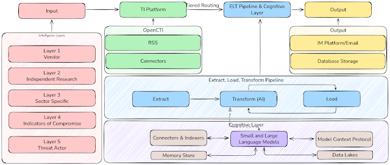

## Intelligence Layer

As with all intelligence sources, some are more valuable than others. We organise our sources into five layers, each serving a distinct purpose in building a comprehensive threat picture. The layering ensures that the pipeline is not over-reliant on any single source type and that intelligence is collected at every level of the threat landscape as to provide a complete picture during analysis.

- **Layer 1 - Vendor:** Government advisories and vendor security bulletins. These are your CISA, NCSC, CERT-EU, and Microsoft MSRC publications. The highest trust, most actionable intelligence available, typically carrying patch priorities and active exploitation warnings
- **Layer 2 - Independent Research:** Security researchers and independent analysts who publish deep technical investigations. Krebs on Security, Bleeping Computer, SentinelOne Labs, and Unit 42 fall into this category. These are the sources breaking new campaigns and tracking threat actor evolution
- **Layer 3 - Sector Specific:** Feeds that are relevant to the organisation's industry. This layer is intentionally left flexible, what sits here depends entirely on the sector you are operating in and the threat landscape that is relevant to your environment
- **Layer 4 - Indicators of Compromise:** Machine-readable threat feeds providing structured indicators, IPs, domains, file hashes, malware samples, and vulnerability data. AlienVault OTX, Abuse.ch (MalwareBazaar, ThreatFox, URLhaus), and the NVD CVE database are the primary sources here. These are not articles to read, they are data points to correlate against
- **Layer 5 - Threat Actor:** Direct collection from threat actor communication channels. Public Telegram channels, dark web monitoring, and community-sourced intelligence lists provide early warning on ransomware victim announcements, data leak postings, and operational chatter. This is the lowest trust layer, but often the earliest signal that something is happening

The value of this layered approach is that it mirrors how threat intelligence is consumed in practice. Leadership cares about Layer 1 advisories and Layer 3 sector relevance. Analysts and researchers work across Layers 2 through 5. The pipeline treats them all as input and lets the downstream processing determine what is actionable.

## TI Platform

All intelligence flows into OpenCTI, an open-source threat intelligence platform that acts as the central aggregation point. OpenCTI normalises incoming data into the STIX standard regardless of its original format, whether that is an RSS article, a structured IOC feed, or a Telegram post scraped via RSS Bridge. The platform maintains a knowledge graph of relationships between threat actors, malware families, attack techniques, vulnerabilities, and campaigns.

RSS feeds and dedicated connectors handle the ingestion from each of the intelligence layers, running continuously to ensure the platform reflects the current threat landscape. OpenCTI's role in this architecture is aggregation and normalisation, it is not performing the analysis. It provides the structured foundation that the downstream pipeline queries against.
## Tiered Routing

This is what makes the pipeline work. Without it, we would be processing nearly 5,000 items per 12-hour cycle, something that exacerbated hallucinations in Small Language Models (SLM) and caused significant pipeline latency during testing. The vast majority of those are individual CVE entries from automated feeds, notably, Microsoft CVE listings, AlienVault for limited value pulses, or low-value noise from Telegram channels, processing all of them would take hours and produce meaningless output.

Tiered routing classifies each report by its source and content before it reaches the processing pipeline. High-value intelligence articles (vendor advisories, research blogs, IOC-containing Telegram posts) are directed into full AI analysis. Structured IOC feeds from platforms like AlienVault OTX are routed into a lighter metadata extraction path that leverages their existing entity tagging. Bulk CVE data and low-value Telegram chatter are dropped from the processing pipeline entirely.

The result is a reduction from thousands of reports down to approximately 50 to 80 items that warrant cognitive processing, with limited loss of intelligence value. Reports that are filtered out remain available in OpenCTI for manual investigation and graph analysis. Tiered routing controls what receives automated enrichment, not what is retained.

## Extract, Load, Transform Pipeline

The processing pipeline follows an Extract, Load, Transform pattern, where the transformation stage is augmented by AI.

**Extract** pulls report metadata, associated STIX entities, and full article content from the TI platform and source websites. For reports with an external reference URL, the pipeline fetches the full article HTML and strips it to clean plaintext suitable for analysis. Reports without a fetchable URL fall back to the description provided by OpenCTI.

**Transform (AI)** is where the cognitive layer comes in. Each qualifying report is analysed by a language model that produces a structured intelligence assessment, covering severity classification, executive summary, identified threat actors and malware families, mapped MITRE ATT&CK techniques, targeted sectors and regions, and extracted indicators of compromise. A second, more capable model then performs cross-report correlation across the entire batch, identifying shared threat patterns, emerging trends, and campaign-level connections that no individual report reveals on its own.

**Load** stores the enriched, structured intelligence into a relational database with full entity relationships, enabling historical querying, trend analysis, and integration with downstream systems.

## Cognitive Layer

The cognitive layer is where the AI processing sits. It is designed to be swappable, local open-source models for environments where data cannot leave the network, or enterprise cloud models where analytical quality is the priority.

The layer supports multiple model roles. Smaller, faster models handle the high-volume per-report extraction tasks, while larger reasoning-focused models handle the lower-volume but higher-complexity correlation and trend analysis. This keeps the pipeline fast where it needs to be fast and smart where it needs to be smart, you are not burning your most capable model on tasks that a smaller one handles adequately.

Looking ahead, this layer can accommodate additional capabilities as they mature. Model Context Protocol integration for dynamic data retrieval during analysis, persistent memory stores for cross-session learning, and connections to broader data lakes for enrichment. These are on the roadmap rather than built today, but the architecture does not need to change to support them.

## Output

The pipeline outputs to two channels. Instant messaging delivers individual report cards and cross-report correlation briefings to analyst and leadership communication channels in real-time. Database storage provides the persistence layer for historical analysis, reporting, and integration with security tooling such as SIEM platforms.

The output layer is decoupled from the processing pipeline, additional delivery channels such as email digests, PDF reports, API endpoints, or SIEM integrations can be added without modifying the core analytical workflow. The same structured data that powers the Discord summaries can be reformatted for any downstream consumer.

# Implementation

The following section focuses on the implementation detail of each component in the pipeline. This is targeted at engineers and researchers looking to understand the technical decisions, constraints, and workarounds that shaped the final implementation. Where the architecture section provides the conceptual overview, this section provides the specifics required to replicate, adapt, or extend the pipeline.

The diagram below illustrates the full implementation pipeline as deployed in N8N. Each section that follows corresponds to a colour-coded segment of the diagram, walking through the nodes, their purpose, and the reasoning behind each design decision.

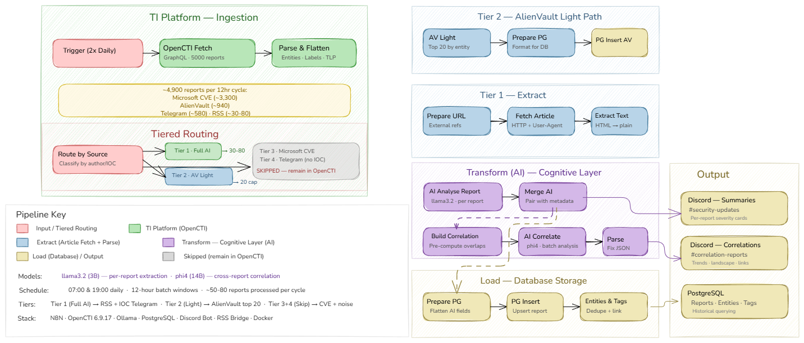

The pipeline is broken down into the following sections:
- **Ingestion:** Scheduled trigger and OpenCTI GraphQL extraction
- **Tiered Routing:** Source classification and volume reduction
- **Tier 2 - AlienVault Light Path:** Metadata extraction without AI processing
- **Tier 1 - Article Enrichment:** Full article fetching and HTML stripping
- **Tier 1 - AI Analysis:** Per-report structured intelligence extraction via Ollama
- **Tier 1 - Correlation:** Cross-report pattern identification and trend analysis
- **Database Storage:** PostgreSQL persistence with entity and tag relationships
- **Discord Output:** Formatted intelligence delivery to communication channels
- **Technical Challenges:** N8N constraints, Large Language Model (LLM) reliability, and workarounds

## Ingestion

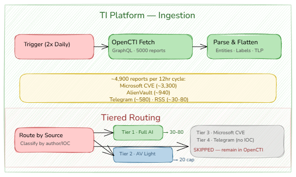

The pipeline is triggered twice daily at 07:00 UTC and 19:00 UTC via a Schedule Trigger node, creating 12-hour batch windows. Each trigger initiates an HTTP POST to the OpenCTI GraphQL API requesting the last 12 hours of reports.

The GraphQL query requests 5,000 reports ordered by creation date. This number is deliberate. Initial testing with first: 500 only captured approximately 10% of the available reports, burying the RSS feed articles that the pipeline was designed to process underneath the volume of automated CVE. The query pulls the full report metadata including STIX entity relationships (AttackPattern, Malware, ThreatActor, IntrusionSet, Vulnerability, Campaign, Tool, Indicator, StixCyberObservable), external references, TLP markings, labels, and the createdBy identity that the tiered routing relies on.

The Parse & Flatten node transforms the nested GraphQL response into a flat structure. Each report is extracted with its entities, labels, TLP marking, external reference URLs, and author identity. This is where the dual-pattern parsing for objectLabel and objectMarking is handled, OpenCTI returns these in inconsistent formats depending on how the data was ingested, so the parsing logic accounts for both array-of-objects and array-of-strings patterns.

## Tiered Routing

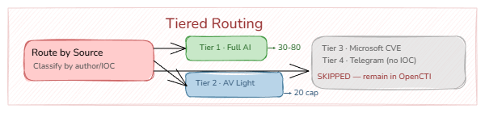

The Route by Source Tier node is a Code node that classifies each report into one of four processing tiers based on two attributes: the createdBy identity ID and regex pattern matching on the report content.

The classification logic is as follows:

- **Tier 1 (Full AI):** Any report with a named createdBy identity that is not Microsoft or AlienVault. This captures all RSS feed articles from CISA, Krebs on Security, Bleeping Computer, Schneier, and the other Layer 1-3 sources. Additionally, Telegram posts (which arrive with a null createdBy) are promoted to Tier 1 if they contain IOC patterns: IP addresses, file hashes (32-64 character hex strings), CVE identifiers, or threat-relevant keywords (ransomware, APT, malware, exploit, zero-day, backdoor, trojan, botnet, C2, stealer, loader, RAT, rootkit, among others)
- **Tier 2 (AlienVault Light):** Reports where createdBy matches the AlienVault identity ID (c998e145-ba64-47e8-8262-3333dee66dbb). These are routed to a lighter processing path
- **Tier 3 (Filter - Microsoft):** Reports where createdBy matches the Microsoft Defender TI identity ID (67209902-ed0f-4679-85f9-768d05a639b7). These are individual CVE entries that constitute approximately 69% of the total volume (~3,300 per cycle). Running AI analysis on "CVE-2026-27969 affects Vitess versions X.Y.Z" adds zero intelligence value
- **Tier 4 (**Filter**- Telegram noise):** Telegram posts without IOC patterns or threat keywords. Defacement mirrors, bragging posts, and general chatter

The IF Not Skipped node drops Tier 3 and Tier 4, and the IF AlienVault node splits the remaining reports into the two processing paths. The result is a reduction from ~4,900 reports to approximately 50-80 items across both paths.

It is worth noting that filtering is performed at the Code node level rather than in the GraphQL query. OpenCTI's GraphQL filters do not support the complex exclusion logic required (author ID matching combined with regex content scanning), so the full 5,000 reports are fetched and classified in N8N where the logic can be expressed freely.

## Tier 2 - AlienVault Light Path

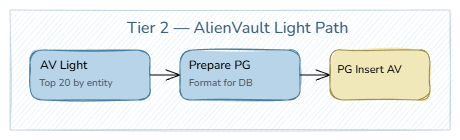

AlienVault OTX pulses arrive with structured entity tagging already applied by the OTX platform. Running these through an LLM for summarisation adds minimal value, the structured data is already there. However, the metadata from these pulses provides valuable context for the correlation stage.

The AlienVault Light Process node sorts pulses by entity count (descending) and caps the output at 20. This prioritises the most IOC-rich pulses, the ones most likely to overlap with Tier 1 reports during correlation. Without the cap, 940+ AlienVault pulses would overwhelm the correlation prompt.

For each pulse, the node extracts threat actors, malware families, attack techniques, and vulnerabilities directly from the OpenCTI entity graph, no LLM required. A severity assessment is applied heuristically: pulses with named threat actors or malware families are marked as high, the remainder as medium.

The AV Prepare for Postgres node formats the extracted metadata into the same schema used by the Tier 1 path, allowing both tiers to be stored in the same threat_reports table. The upsert operation uses opencti_id as the conflict key to prevent duplicates across pipeline runs.

## Tier 1 - Article Enrichment

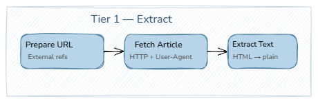

The Prepare Article URL node extracts the first external reference URL from each report. These URLs point to the original source article, whether that is a CISA advisory, a Krebs on Security blog post, or a Telegram channel message.

The Fetch Full Article node performs an HTTP GET with a realistic browser User-Agent header. The User-Agent is necessary because several sources (notably Cloudflare-protected sites) return 403 responses to requests that lack a recognisable browser signature. A 10-second timeout is applied, and the node is configured to continue on error, reports that fail to fetch are not dropped from the pipeline.

The Extract Text & Merge node strips the fetched HTML to plaintext. The stripping is aggressive: `<script>, <style>, <noscript>, <nav>, <header>, <footer>,` and `<aside>` elements are removed entirely, then all remaining HTML tags are stripped. HTML entities (&amp;, &lt;, &gt;, &quot;, &nbsp;) are decoded, and whitespace is normalised. The resulting text is truncated to 4,000 characters to fit within the context window of the analysis model.

If the fetch fails or the extracted text is shorter than 100 characters, the node falls back to the OpenCTI description. This ensures that every Tier 1 report has some content for the AI to work with, even if the source article was blocked.

## Tier 1 - AI Analysis

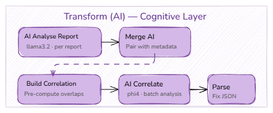

This is the first SLM touchpoint in the pipeline. The AI Agent - Analyse Report node sends each report to Ollama running llama3.2 (3B parameters) with JSON format enforced.

### Per-Report Prompt

The prompt provides the model with four inputs: the report title, the enriched description (full article text or OpenCTI fallback), the STIX entities already associated with the report in OpenCTI, and the source labels. The model is instructed to return a structured JSON object containing:

- report_type - one of seven categories (threat-report, malware-analysis, vulnerability-alert, security-news, law-enforcement, best-practice, vendor-advisory)
- executive_summary - 2-3 sentence CISO-readable summary
- technical_summary - TTP detail or N/F
- threat_actors, malware_families, attack_techniques - extracted or inferred from content
- targeted_sectors, targeted_regions - from content or context
- iocs_mentioned, cves_mentioned - specific indicators
- severity_assessment - critical, high, medium, low, or info with defined criteria
- tags - minimum three keywords for categorisation
- kill_chain_phases - mapped phases or N/F

### System Prompt Guardrails

SLMs require explicit constraints that larger models handle implicitly. The system prompt includes the following guardrails, all of which were added iteratively based on observed failure modes during testing:

- **No empty arrays**- the model must use ["N/F"] for absent fields rather than [], this prevents downstream null handling issues in the entity extraction pipeline
- **No MITRE ATT&CK on geopolitical content**- without this instruction, the model assigns T1566 (Phishing) and T1071 (Application Layer Protocol) to virtually every report, including law enforcement actions and general security news. This was one of the more frustrating behaviours to pin down
- **Nation states are not threat actors**- the model was classifying countries involved in military conflicts as cyber threat actors, this rule restricts the threat_actors field to named cyber groups (APT37, Lazarus, FIN7, etc.)
- **Severity criteria**- critical requires an active zero-day or major breach in progress, high requires a named APT campaign or new malware family, medium covers law enforcement actions and disclosed breaches, low applies to best practices and patch advisories, info covers opinion pieces and general news

_Researchers Note: These guardrails are specific to llama3.2 at 3B parameters. Larger models (8B+) or cloud models may not require the same level of explicit instruction, though testing against your chosen model is recommended before removing any of them._

### Merge AI Summary
The Merge AI Summary node pairs the AI output with the original report metadata using index tracking. The AI response is parsed with a JSON extraction that accounts for common LLM output failures: markdown code fences around the JSON, preamble text before the opening brace, and invalid control characters. If parsing fails entirely, a fallback object is constructed with the raw AI output as the executive summary and N/F values for all structured fields.

## Tier 1 - Correlation


This is the second LLM touchpoint and the most analytically demanding step in the pipeline. The Build Correlation Prompt node assembles all Tier 1 AI summaries and Tier 2 AlienVault metadata into a single prompt, then sends it to phi4 (14B parameters) for cross-report analysis.
### Why a Separate Model
llama3.2 at 3B parameters is sufficient for single-document extraction but falls over with multi-document reasoning. Initial testing with llama3.2 for correlation produced two consistent failure modes: the model fixated on the first or most distinctive report in the batch and ignored the remaining 30+, and it copied template options literally (returning "correlation_type": "TTP|ACTOR|MALWARE|SECTOR|CAMPAIGN|INFRASTRUCTURE" instead of selecting one value). phi4 at 14B parameters with a lower temperature (0.3) and an 8,192-token context window resolved both issues.

### Pre-Computed Overlap Hints
Rather than relying entirely on the model to discover relationships across 37+ reports, the Build Correlation Prompt node pre-scans all reports and identifies shared elements before the LLM sees the data:

DETECTED OVERLAPS:
- Actor "Lazarus" appears in: Report Title A | Report Title B
- Malware "Cobalt Strike" appears in: Report Title C | Report Title D
- CVE "CVE-2026-1234" appears in: Report Title E | Report Title F

This is computed by building frequency maps across threat actors, malware families, ATT&CK technique IDs, CVE identifiers, and targeted sectors. Any element appearing in two or more reports is flagged. This gives the model a cheat sheet rather than asking it to find needles in a haystack. It still needs to assess whether the overlaps are meaningful and identify thematic connections that the exact-match scan cannot detect, but it is not starting from scratch.

_Researchers Note: The pre-computed hints were added after observing that phi4 would identify only 2 correlations from a batch of 37 reports without them. With the hints, the same batch produced 6-8 correlations with significantly better quality. The model uses them as starting points and then builds on top of them with its own analysis._

## Database Storage

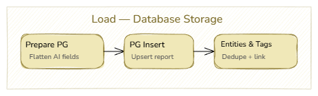

The storage pipeline handles three tables: threat_reports, entities, and report_tags, with a linking table report_entities for the many-to-many relationship between reports and entities.
### Report Insertion
The Prepare for Postgres node flattens the AI-enriched data into the threat_reports table schema. The Postgres - Insert Report node performs an upsert keyed on opencti_id, meaning re-runs of the pipeline update existing reports rather than creating duplicates. This matters for the twice-daily schedule, reports that appeared in the 07:00 cycle and are still within the 12-hour window at 19:00 get updated rather than duplicated.

### Entity Extraction and Linking
The Prepare Entities & Tags node extracts all entities from both the OpenCTI graph (STIX entities already associated with the report) and the AI output (threat actors, malware families, attack techniques identified by the model). These are deduplicated using a type::name composite key.

The entity insertion uses a CTE (Common Table Expression) that inserts or updates the entity in the entities table and then creates the link in report_entities in a single query:

```sql
WITH ent AS (

INSERT INTO entities (entity_type, name, stix_id, last_seen)

VALUES ('threat-actor', 'Lazarus Group', 'intrusion-set--...', NOW())

ON CONFLICT (entity_type, name) DO UPDATE SET last_seen = NOW()

RETURNING id

)

INSERT INTO report_entities (report_id, entity_id, relationship)

SELECT '123', ent.id, 'mentions' FROM ent

ON CONFLICT DO NOTHING;
```

Tags follow the same pattern but with a simpler insert into report_tags.

### SQL Injection Handling
N8N's Postgres node does not support parameterised queries in executeQuery mode. All user-data fields use .replaceAll("'", "''") escaping in N8N template expressions. This is necessary because STIX patterns frequently contain single quotes (e.g., [file:hashes.'SHA-256' = '...']) that would break unescaped queries.

_Researchers Note: This is not ideal from a security perspective. Parameterised queries would be preferred, but N8N does not support them in raw query mode at the time of writing. The escaping approach handles the known edge cases from STIX patterns, but if you are adapting this pipeline for a production environment with untrusted input, consider using N8N's built-in upsert operations where possible instead of raw queries._

## Discord Output

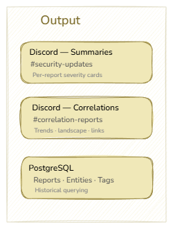

The pipeline delivers intelligence to two Discord channels via the Discord Bot API.

### Threat Intelligence Digest (#security-updates)

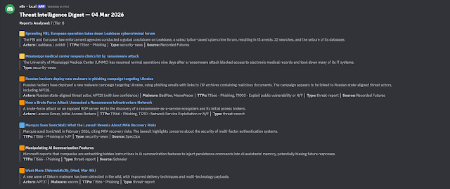

The Format Summaries for Discord node generates a per-report card for each Tier 1 report. Each card contains:
- A colour-coded severity icon (red square for critical, orange for high, yellow for medium, green for low, blue for info)
- The report title as a masked hyperlink to the source article with embed suppression
- An executive summary in a blockquote
- Metadata line with threat actors, malware, TTPs, CVEs, report type, and source, separated by pipe characters

### Threat Correlation Report (#correlation-reports)

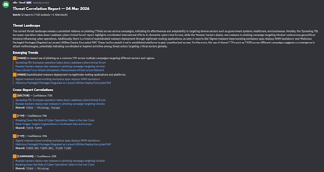

  The Format Correlation for Discord node generates the correlation output in three sections:

- **Threat Landscape** - the model's multi-paragraph assessment of the batch
- **Emerging Trends** - each trend with a risk-level icon, description, and evidence (linked report titles)
- **Cross-Report Correlations** - each correlation with a confidence percentage, correlation type, the linked reports, and the shared elements in a code block

Both formatters implement Discord's 2,000-character message limit by splitting on section boundaries. A Wait node with a 1.5-second delay is placed before each Discord send to avoid rate limiting.

### Link Formatting

Discord masked links use the syntax `[title](<url>)` where the angle brackets suppress the URL embed preview. The `linkTitle` function in the correlation formatter implements fuzzy matching against the URL map, normalising both the report title and map keys by stripping non-alphanumeric characters before comparison. This accounts for the model occasionally modifying titles through minor punctuation changes or truncation.

# Technical Challenges

The following section covers the technical constraints and workarounds that were encountered during development. These are not edge cases, they are recurring issues that any implementation using N8N, Ollama, and local LLMs will hit.

## N8N JavaScript VM Constraints

N8N's sandboxed JavaScript Code node runs an older V8 environment with several limitations that affect how code is written:

- **No**` const `**or**` let `- all variables must use var
- **No arrow functions** - all functions must use function() syntax
- **Emoji handling** -` String.fromCharCode()` with surrogate pairs does not reliably produce emoji in the N8N runtime. Unicode escape sequences (\ud83d\udfe5) within string literals are required
- **No fetch API** - HTTP requests must be handled via dedicated HTTP Request nodes, not within Code nodes

These constraints mean that all Code nodes in the pipeline are written in ES5-compatible JavaScript. This is not a stylistic choice, it is a reliability requirement. Newer syntax will work in some N8N versions and silently break in others.

## LLM JSON Output Reliability

Local language models do not reliably produce valid JSON, even with format: "json" enforced in the Ollama API call. The following failure modes were observed and handled:

- **Markdown code fences -** the model wraps its JSON in ```json ``` blocks. The parse node strips these before parsing
- **Preamble text -** the model outputs "Here is the analysis:" before the JSON. The parse node finds the first { and last } and parses the substring
- **Trailing commas -** `[item1, item2,]`is common. The parse node removes trailing commas before closing brackets and braces
- **Control characters -** newlines and tabs inside JSON string values break parsing. The parse node strips all control characters (0x00-0x1F) before parsing
- **Pipe-separated enum values -** the model lists all options instead of selecting one. The parse node splits on | and takes the first valid value

The Parse Correlation Results node implements all of these as sequential cleanup steps before attempting JSON.parse(). If parsing still fails, a regex-based fallback extracts the threat_landscape_summary field directly from the raw text.

_Researchers Note: These are not occasional glitches. With llama3.2 at 3B parameters, roughly 1 in 10 responses requires at least one of these cleanup steps. The pipeline needs to handle them as a matter of course, not as exception handling._

## Model Context and Memory

Ollama's phi4 at 14B parameters requires approximately 9-10GB of RAM for model weights, with additional memory for the KV cache that scales with the context window size. The initial configuration used numCtx: 16384 (16K tokens), which caused the Linux OOM killer to terminate the Ollama process when running alongside the full OpenCTI stack.

The resolution was to reduce numCtx to 8192, which halved the KV cache memory footprint. The correlation prompt for 37 reports fits within 8K tokens with the compressed report format. For implementations with more available memory or GPU offloading, numCtx can be increased to accommodate larger batches.

Running both llama3.2 and phi4 simultaneously doubles the memory requirement. Setting `OLLAMA_MAX_LOADED_MODELS=1` in the Ollama environment ensures one model is unloaded before the other is loaded, at the cost of a ~10 second model swap delay between the analysis and correlation stages.

## Article Fetch Reliability

Not all source articles are successfully fetched. Cloudflare-protected sites return 403 responses even with a browser User-Agent, paywalled content returns truncated HTML, and some RSS feed URLs point to landing pages rather than the article itself. The pipeline handles this through graceful fallback, if the fetch fails or produces insufficient text, the OpenCTI description is used instead. This means the AI analysis for those reports is working with less context, but the report is not lost.

## Title Hallucination in Correlation

This was the most persistent quality issue we encountered. When presented with multiple reports, both llama3.2 and phi4 default to creating shorthand references ("Report 1", "the first report", "the Adobe vulnerability report") rather than using the exact title provided. This breaks the Discord formatter's URL linking, which relies on exact title matching against the URL map.

The mitigation is multi-layered: the prompt format uses --- REPORT: Exact Title ---headers, the system prompt explicitly forbids numbered references with wrong and correct examples, and the prompt includes an actual title from the current batch. The parse node additionally checks for numbered references in the output and can flag them. With phi4 at temperature 0.3, this combination produces correct titles in the majority of cases, though occasional mismatches still occur and are handled by the fuzzy title matching in the Discord formatter.

_Researchers Note: Title hallucination is a well-documented behaviour in local language models when processing multiple documents. If you are implementing this with a cloud model (Claude, GPT-4o), you may find that a single instruction is sufficient. With local models at the 3-14B parameter range, the repeated reinforcement across system prompt, user prompt, and examples is necessary. However, there maybe further tweaks to the architecture required to scale to meet the enterprise demand._

# Bibliography

[1] - [Best Strategies to Minimize Hallucinations in LLMs: A Comprehensive Guide](https://www.blogger.com/u/1/blog/post/edit/8882042398405863179/5023927187995908110?hl=en#)

[2] - [Bitsight Vulnerability Threat Intelligence](https://www.blogger.com/u/1/blog/post/edit/8882042398405863179/5023927187995908110?hl=en#)

[3] - [MITRE ATT&CK](https://www.blogger.com/u/1/blog/post/edit/8882042398405863179/5023927187995908110?hl=en#)

[4] - [n8n Beginner Course](https://www.blogger.com/u/1/blog/post/edit/8882042398405863179/5023927187995908110?hl=en#)

[5] - [n8n Quick Start Tutorial: Build Your First AI Agent [2026]](https://www.blogger.com/u/1/blog/post/edit/8882042398405863179/5023927187995908110?hl=en#)

[6] - [OpenCTI](https://www.blogger.com/u/1/blog/post/edit/8882042398405863179/5023927187995908110?hl=en#)

[7] - [Self-hosted n8n AI Starter Kit](https://www.blogger.com/u/1/blog/post/edit/8882042398405863179/5023927187995908110?hl=en#)
